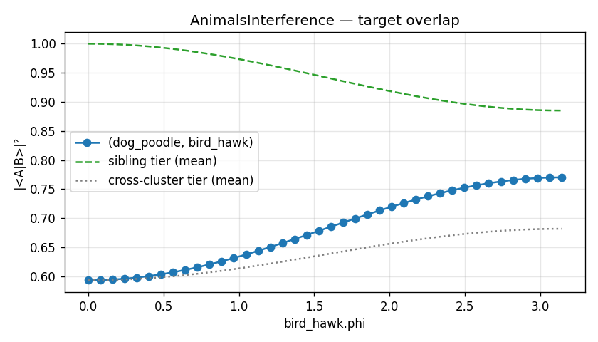
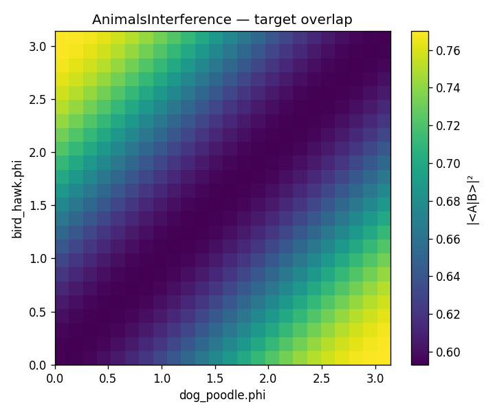

# Polygram

**Quantum Interference Laboratory for Polysemantic Feature Dictionaries**

Polygram is a researcher-friendly Python frontend that emits verifiable
[Q-Orca](https://github.com/jascal/q-orca-lang) `.q.orca.md` machines for
mechanistic-interpretability experiments on hierarchical polysemantic feature
dictionaries.

It builds on Q-Orca's rung-1 MPS encoding with safe `Rz` phase knobs (q-orca
PR #51) to enable phase-interference sweeps, destructive cancellation studies,
entanglement probes, and hybrid measurement-feedback steering on
SAE-style dictionaries.

## Status

Pre-alpha. v0 milestone is closed (bootstrap → core dictionary →
experiment/sweep → animals example, polished with tier stats / plots /
CLI / 2D landscapes → SAE import → `Cancellation` primitive). New
work is staged through OpenSpec changes — see `openspec/changes/`.

## Install

```bash
pip install -e ".[dev,plot]"   # editable install with test + plot deps
pytest                          # run the suite
```

Optional extras: `[plot]` (matplotlib), `[notebook]` (jupyter +
matplotlib), `[opt]` (scipy — enables the `Cancellation`
`method="scipy"` backend), `[sae]` (reserved for a future SAE-Lens /
safetensors loader; empty in v0 — JSON loader for the bundled toy
fixture has no extra deps).

## Layout

```
polygram/         — Python package
openspec/         — spec-driven change proposals + capability specs
tests/            — pytest suite + bundled fixtures
examples/         — Python scripts + notebook walking tour
docs/img/         — README screenshots
```

## Capacity limits

The rung-1 MPS encoding represents each feature as a 3-qubit state
parametrized by α/β/γ/φ. This caps a `Dictionary` at **8 features**
(in practice ≤6 is most ergonomic). Real SAEs ship 16k–1M features —
which is why the `from_sae_lens(...)` importer (below) is
**selection-first**: you name the subset you want to study, and
Polygram tells you how lossy the projection-vector → β collapse was
via `SelectionReport.beta_variance_explained`. The bridge is to
*small, focused experiments* on a handful of features, not bulk
SAE simulation.

## Quickstart

```python
import numpy as np

from polygram import Dictionary, Experiment, Feature, MPSRung1

dictionary = Dictionary(
    name="AnimalsInterference",
    features=[
        Feature("dog_poodle",   "dogs",  beta=-0.5),
        Feature("dog_beagle",   "dogs",  beta=-0.5),
        Feature("bird_hawk",    "birds", beta= 0.5),
        Feature("bird_sparrow", "birds", beta= 0.5),
    ],
    hierarchy={"dogs": ["dog_poodle", "dog_beagle"],
               "birds": ["bird_hawk", "bird_sparrow"]},
    encoding=MPSRung1(bond_dim=2, phase_knobs=True),
)

experiment = Experiment(
    name=dictionary.name,
    dictionary=dictionary,
    target_pair=("dog_poodle", "bird_hawk"),
    sweep={"bird_hawk.phi": np.linspace(0.0, np.pi, 40)},
    measures=["overlap", "gram_matrix", "schmidt_rank"],
    assertions=["hierarchical_ordering_preserved"],
)

experiment.materialize("examples/output/")   # emits a verifiable .q.orca.md
result = experiment.run()                    # analytic Gram per sweep point
result.to_csv("examples/output/result.csv")
```

See `examples/animals_interference.py` and the matching
`examples/animals_interference.ipynb` notebook for the full walking tour.

### Plots

`result.plot(path)` saves a default figure: 1D sweep → line plot of
target-pair overlap with sibling and cross-cluster tier baselines; 2D
sweep → heatmap. Requires the `[plot]` extra (`pip install polygram[plot]`).

**1D sweep** — `bird_hawk.phi` from 0 to π. Single-φ steering on this
geometry leaves the cross-cluster overlap above the matched-φ baseline
of `cos(0.5)⁴ ≈ 0.5931` and below the sibling tier; it never destroys.



**2D sweep** — `(dog_poodle.phi, bird_hawk.phi)` 24×24 grid. The
landscape rises from the matched-φ ridge of `cos(0.5)⁴ ≈ 0.5931` (the
β-overlap baseline) toward off-axis cells; the asymmetry is what
`Cancellation` searches over directly.



## Cancellation

`Cancellation` is the second experiment primitive: given a
`target_pair`, it searches the two φ values that drive the pair's
`|<A|B>|²` toward a tolerance, optionally constrained to preserve the
hierarchical-tier ordering. Two backends ship — a deterministic
`max_steps × max_steps` grid scan over `[0, 2π]²` (default, no extra
deps) and `scipy.optimize.differential_evolution` behind `[opt]`.

```python
from polygram import Cancellation

cancellation = Cancellation(
    dictionary=dictionary,
    target_pair=("dog_poodle", "bird_hawk"),
    tolerance=0.05,
    preserve_tiers=True,
    optimize={"method": "grid", "max_steps": 50},
)

result = cancellation.run()
print(result.before_overlap, result.after_overlap, result.tolerance_met)
result.materialize("examples/output/")     # writes optimized .q.orca.md
result.plot("examples/output/grid.png")    # heatmap with infeasible mask
```

Returns a `CancellationResult` exposing `optimized_phis`,
`before_gram` / `after_gram`, `trajectory` (every `(φ_a, φ_b, overlap)`
evaluation in order), `feasible_mask`, `feasible_count`, and
`dictionary_at_optimum` — the new `Dictionary` baked with the
optimized φs and re-emittable via `materialize` as a verifiable
Q-Orca artifact.

### Structural floor

Pure-φ search on a fixed `(α, β, γ)` configuration is bounded: the
target-pair overlap factors as `|<A|B>|²(δ) = M + V·cos(δ)` where
δ = φ_A − φ_B, so phase alone cannot drive overlap below `M − |V|`.
`Cancellation.structural_floor()` returns this analytic minimum
(two Gram evaluations, backend-free), and `CancellationResult`
caches it as `result.structural_floor`. The companion
`result.cancellation_efficiency` reports
`(before − after) / (before − floor)`, clamped to `[0, 1]`:
`1.0` means phase search exhausted the available gap (residue is
encoding-bound — driving overlap lower needs amplitude matching),
`None` means there was no gap to begin with. The materialized
`<name>_summary.md` reports both, plus a one-line interpretation.
See [`docs/research/cancellation-phase-floor.md`](docs/research/cancellation-phase-floor.md)
for the full derivation.

See `examples/cancellation_example.py` for the combined
SAE → InterferenceSweep → Cancellation walk.

### CLI

The `polygram` console script runs an example or experiment module
that exposes `main(output_dir=...)`:

```bash
polygram run examples/animals_interference.py --output-dir results/
polygram run examples/import_from_sae.py --output-dir results/
polygram --version
```

## SAE import

`polygram.from_sae_lens(records, feature_ids, ...)` builds a Polygram
`Dictionary` from a user-selected subset of SAE features and returns a
`SelectionReport` describing how the lossy projection-vector → β
collapse went. Cluster assignment precedence: explicit user override →
parsed `"<cluster>/<name>"` labels → k-means on projection vectors.

```python
from polygram import from_sae_lens, load_toy_sae

records = load_toy_sae("tests/fixtures/toy_sae.json")
# pick 4 features by id (≤8; the rung-1 MPS cap)
dictionary, report = from_sae_lens(records, [0, 1, 4, 5])

print(report.cluster_method)             # "from_labels" / "kmeans" / "user"
print(report.beta_variance_explained)    # cluster-level fidelity stat
print(report.reconstruction_error)       # per-feature distance to centroid
print(report.tier_preservation)          # corr(projection-space cosines,
                                         # analytic Polygram Gram) — None
                                         # for n_selected ≤ 1
```

`SelectionReport` surfaces three fidelity stats per call:
`beta_variance_explained` (cluster-level), `reconstruction_error`
(per-feature Euclidean distance from each projection vector to its
assigned cluster centroid), and `tier_preservation` (Pearson
correlation between off-diagonal `|G|²` of the projection-space
cosine-overlap matrix and the analytic Polygram Gram of the built
Dictionary).

Pass `assign_gamma=True` to derive each feature's γ from per-cluster
PCA on the centered projection vectors (rescaled into
`gamma_range`, default `(-0.25, 0.25)`); `report.gamma_method`
records `"zero"` (default) or `"projection_pca"`.

The bundled `tests/fixtures/toy_sae.json` is a 16-feature, 4-cluster,
8-dim deterministic toy. To swap in a real SAE-Lens / safetensors / HF
SAE, hand-roll a `dict[int, SAEFeatureRecord]` from your loader of
choice and pass it to `from_sae_lens`. A first-class
`load_sae_lens(...)` reader for SAE-Lens checkpoints is on the
roadmap; v0 stays out of the safetensors / torch dep tree.

See `examples/import_from_sae.py` for the full flow (toy SAE →
Dictionary → `InterferenceSweep` → verified `.q.orca.md` + plot).

## Development

```bash
pip install -e ".[dev,plot]"
pytest
```

## Relationship to Q-Orca

Polygram does **not** define a new file format. It generates standard
Q-Orca `.q.orca.md` files (matching the style of
`examples/larql-animals-interference.q.orca.md` from q-orca-lang) and uses
Q-Orca for verification, simulation, and the analytic Gram helper
`compute_concept_gram_mps`.

## License

Apache-2.0.
